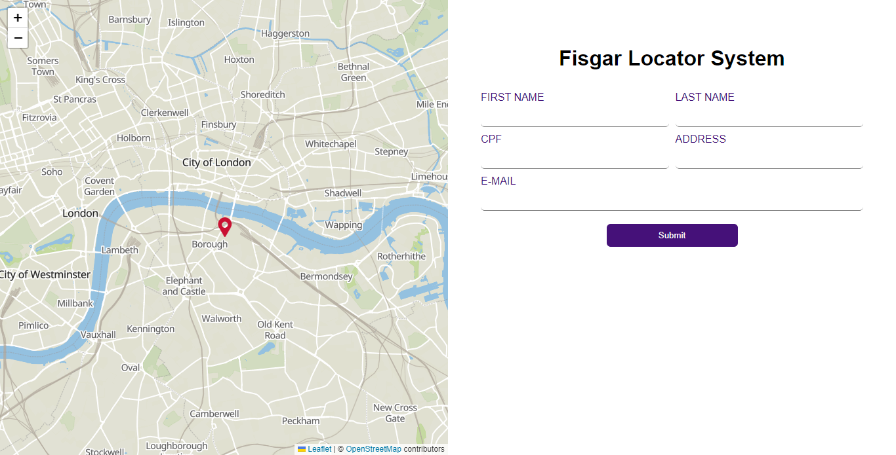

# Fisgar Locator

é um sistema de localização de usuários, desenvolvido com reactJs.

# Acerca do projecto

Este Projecto foi desenvolvido com  [Create React App](https://github.com/facebook/create-react-app).

## Aplicação

para rodar a aplicação é necessário:

1 - abra o terminal e digite npm install ou yarn (para a instalação das depenências do projecto)
 
2 - yarn start ou npm run start (para executar o projecto)
 
3 - yarn build ou npm run build (para rodar em produção)

 

## Linguagens de Programação

<h5>-Typescript</h5>

## Bibliotecas usadas no Projecto

<ol>
    <li>React</li>
    <li>Leaflet</li>
    <li>React-Leaflet</li>
    <li>Material UI</li>
    <li>Formik</li>
    <li>Yup</li>
    <li>Redux-Tolkit - Redux - React Redux</li>
</ol>